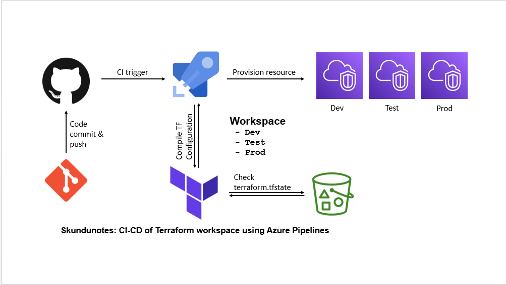
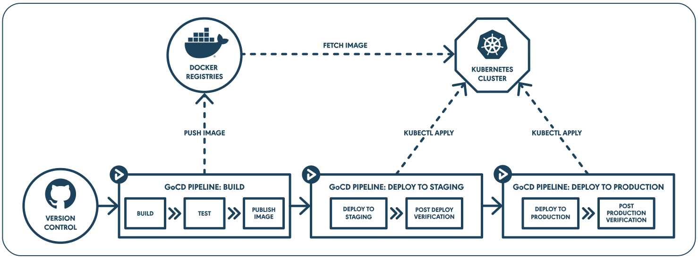

# Terraform Workshop

## Prerequisites
1. Install `Gcloud cli`. Checkout https://cloud.google.com/sdk/docs/install. Run `gcloud init` and `gcloud auth application-default login` to setup
2. Install `Terraform CLI`. Checkout https://developer.hashicorp.com/terraform/tutorials/aws-get-started/install-cli

## Common steps when provisioning infrastructure
1. Design your technical architecture. Draw this in Excalidraw or Figma would benefit you the most
2. Decide which backend to store Terraform state files. Popular are GCS, AWS S3, Terraform Cloud but for practicing, they can be stored locally.
3. Start writing from the most independent component and go from there.
4. `terraform init` to downloading providers and modules and also initializing terraform backend.
5. `terraform plan` to see the changes you about to make
6. `terraform apply` to make initial changes.
8. Refactor. Which constants or values can be parameterized ? If we want to deploy the stack to other environments, how should we restructure the code ? etc.
9. Make sure the result is the same after refactoring by running `terraform apply` again, no changes should be reported.
11. When done, run `terraform destroy`

You should commit your code as often as possible because rollbacks will be super easy.

## Terraforming in an ideal environment

